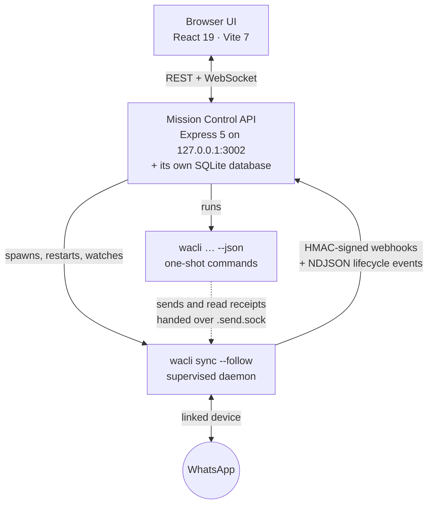

<div align="center">

# 🛰️ wacli Mission Control

**WhatsApp, but make it a control room.**

A local-first, keyboard-driven, safe-by-default browser console for [wacli](https://wacli.sh).<br>
Read, search, schedule and (carefully) send WhatsApp messages from a big screen and a real keyboard.

[](https://www.npmjs.com/package/wacli-mission-control)
[](https://github.com/greenido/wacli-ui/actions/workflows/build.yml)
[](#quick-start)
[](#-safety-rails-aka-are-you-sure-sure)
[](LICENSE)

[Quick start](#quick-start) · [Tour](#the-tour) · [Shortcuts](#keyboard-shortcuts) · [How it works](#how-it-works) · [Security](#security--privacy) · [Config](#configuration) · [API](#rest--websocket-api) · [FAQ](#faq)

</div>

---

Your phone has a six-inch screen and a keyboard made of glass. Your desk has a big monitor and a keyboard you're actually fast on. **Mission Control moves WhatsApp to the desk.**

[wacli](https://wacli.sh) already does the hard part: it pairs with your account as a linked device and mirrors your history into a local SQLite database with full-text search. Mission Control is the cockpit on top. It supervises wacli's sync daemon, streams live events into your browser, and wraps every outgoing action in enough guardrails to make an airline safety officer tear up a little.

```
┌────────────────────────────────────────────────────────────────────────────────────┐
│ LIVE OPERATOR MODE (MUTATIONS ENABLED)                        [ ENGAGE SAFE MODE ] │
├──────────────────────┬────────────────────────────────────┬────────────────────────┤
│ CHATS              + │ Ada Lovelace         INFO  EXPORT  │ SYSTEM STATUS    z ? , │
│ [ search chats   / ] │ ARCHIVE Mar 14, 2021 · 4,211 MSG   │ MODE        LIVE WRITE │
│ All Unread Pinned .. │                                    │ DAEMON      running    │
│ #family  #work       │  Is the engine ready?              │ WS RELAY    connected  │
│                      │                             09:41  │ HEARTBEAT   2s ago     │
│ > Ada Lovelace   (2) │                                    │ STORE LOCK  daemon     │
│   typing...          │              Almost. Coffee first. │                        │
│   Charles Babbage    │                       09:42  read  │ ACTIVITY  |  LATER (1) │
│   You: see you at 9  │                                    │ sent -> Ada      09:42 │
│   Engine Club   (12) │                                    │ 09:00 -> Charles       │
│   Ada: it compiles!  │ [+] Message Ada...   LATER  SEND   │                        │
└──────────────────────┴────────────────────────────────────┴────────────────────────┘
```

- 🏠 **Local, full stop.** It listens on `127.0.0.1` and talks to the wacli on your machine. No cloud relay, no accounts, no sign-up.
- 🦺 **Safe by default.** A fresh install is read-only. Unlock it once and it stays unlocked, but every text and file is still read back to you before it leaves.
- ⚡ **Live.** Messages, receipts and `typing...` show up the moment wacli sees them. There's no refresh button, because you don't need one.
- ⌨️ **Keyboard-first.** `J`/`K` through chats, `R` to reply, `Cmd+K` to search everything. The mouse is optional.
- ⏰ **Send Later that sends once.** A scheduled message goes out at most once, even if the app crashes mid-send.
- 🌙 **Sleep mode.** Stop syncing for the night while the scheduled queue keeps its alarm clock.

> **Unofficial, and proud of it.** Mission Control is not affiliated with WhatsApp or Meta. wacli is an unofficial client built on [whatsmeow](https://github.com/tulir/whatsmeow), and this is an unofficial UI for it. Use it the way you'd use WhatsApp Web: for your own account, at human speed.

---

## Quick start

**You'll need:**

1. **Node.js 22.5 or newer.** That's where `node:sqlite` landed, and Mission Control keeps its own state in it. No native modules to compile, no tears.
2. **wacli, installed and paired** with your WhatsApp account:

   ```bash
   brew install openclaw/tap/wacli   # other ways to install: https://wacli.sh
   wacli auth                        # scan the QR code from WhatsApp > Linked devices
   ```

   A recent wacli (0.18.2 or later) works best: it lets Mission Control hand sends and read receipts to the running sync daemon. Older versions still work; Mission Control just pauses the daemon for each send.

**Then launch:**

```bash
npx wacli-mission-control --open
```

That's it. The console opens at **http://127.0.0.1:3002**, starts the wacli sync daemon for you, and begins in **safe read-only mode**: read, search and poke around all you like. Nothing leaves until you press **UNLOCK LIVE SENDS**.

Prefer a permanent install?

```bash
npm install -g wacli-mission-control
wacli-mission-control        # or `wacli-ui`: same app, fewer keystrokes
```

| Flag | What it does |
| :--- | :--- |
| `-p`, `--port <n>` | Listen on another port (default `3002`, or `$PORT`) |
| `-o`, `--open` | Open the console in your browser once it's up |
| `--no-sync` | Don't start `wacli sync --follow` (same as `WACLI_DISABLE_SYNC=1`) |
| `-v`, `--version` | Print the version |
| `-h`, `--help` | Print the help |

There's no `--host` flag, and that's on purpose. See [Security & privacy](#security--privacy).

---

## The tour

### 💬 Three panes, one keyboard

**Left: your chats.**
- Unread counts, names, and a last-message preview (`You:` when it's yours; media is described instead of left blank).
- Live `typing...` indicators.
- Quick filters (**All · Unread · Pinned · Muted · Archived**) plus a tag row that narrows the list to your own labels.
- A filter box for names and JIDs, debounced so a word costs one query instead of one per letter.
- **+** starts a new chat with a saved contact or a phone number.

**Center: the conversation.**
- The full thread, with group sender names, system notices, edits and deletions.
- Delivery ticks: sent, delivered, read, played.
- Inline media: images, stickers, video, voice notes with 1× / 1.5× / 2× playback, and documents to download.
- Hover a message to reply, react, copy or bookmark. The emoji drawer has a quick row, four categories, a search box, and the good sense to open where a sidebar won't cover it.
- A composer that keeps a separate draft, attachment and reply target for every chat.

**Right: mission status.**
- Mode, wacli version, daemon state and PID, WebSocket relay, heartbeat, store lock and linked identity, plus a **Restart Daemon** button for bad days.
- **ACTIVITY**: every outgoing send with a status badge. The server records it, so it survives a refresh, reads the same in every tab, and includes scheduled messages that fired while no console was open. Scroll for more; entries expire after 90 days.
- **LATER**: the scheduled queue. Everything pending is always shown, because a queue that hides what's about to go out isn't one you can trust.

Drag either splitter to resize a rail, and double-click it to snap back. The widths are remembered.

### 🦺 Safety rails (a.k.a. "are you *sure* sure?")

- **Read-only on first run.** A fresh install can't send, reply, react, set an alias, backfill history or fire a scheduled message. It won't even send read receipts. You unlock live sends when you're ready.
- **Your choice sticks.** Safe mode is a first-run default, not a nag. Unlock it once and it stays unlocked across restarts. Nothing but you ever changes it.
- **Read-back before anything leaves.** Texts, files, replies and Send Later all stop at a confirmation step that shows the recipient JID, the exact payload, and the message you're replying to. Reactions skip it (it's one emoji, and you just picked it), but safe mode still blocks them.
- **`Cmd+Shift+L` asks first.** Unlocking is the one guardrail a stray key chord could drop, so the shortcut opens a confirmation instead of flipping the switch.
- **Belt and suspenders.** In safe mode, every wacli command runs with `WACLI_READONLY=1`, so even a request that somehow slipped past the API's lock would run into wacli's.
- **Drafts stay in their lane.** Switching chats can never carry a draft, an attachment, or a reply aimed at one thread into another.
- **Scheduled messages respect the lock.** A message that comes due in safe mode doesn't sneak out, and it doesn't sit there quietly either. It fails loudly, in red, with the reason. Unlock live sends and resend it.

### ⏰ Send Later

- **`Cmd+Enter`** (or the **LATER** button) schedules the current draft, text or file. The queue lives in Mission Control's database, so it survives restarts.
- A chat with pending messages shows them in a banner with a one-click **CANCEL**. A failed message can be **RESENT** (now or at a new time) or **DISCARDED**.
- **Sent at most once.** A due message is marked `sending` on disk before wacli is asked. If Mission Control dies mid-send, the next start marks that message failed instead of sending it again, because it may already have gone out. The resend dialog leaves the call to you. One birthday wish is sweet; two is a bug.
- **Attachments wait somewhere safe.** A queued file is kept in `~/.wacli-mission-control/scheduled-files/` (mode `0700`), not in a temp directory your OS likes to tidy. It's deleted once it's sent, cancelled or discarded. If it vanishes anyway, the message fails and says why. The caption never goes out alone.
- Each message is saved on its own, so one the database rejects can't stop the rest of the queue from being saved.

### 🌙 Sleep mode

*Put the console to bed. The alarm clock keeps working.*

- The **moon button** in the status strip stops the `wacli sync` daemon and all polling. The screen stays as it was, under a banner that says when sleep began, how many messages are scheduled, and when the next one is due.
- **Scheduled messages still go out on time.** Each send connects to WhatsApp on its own and leaves the daemon asleep afterwards.
- **Only you can wake it.** No timer, reconnect, server restart or scheduled send will. Press **WAKE**, or do something that needs fresh data or sends:
  - open another chat;
  - change the rail filter, or type in its box;
  - search, or open New chat or Chat info;
  - load older messages, export, or request older history from your phone;
  - send, reply or react;
  - reload the page, or open another tab.

  Every wake is logged with its reason. Scrolling, bookmarks, tags, Help, Settings, safe mode, queueing a Send Later, and the LATER queue's own buttons all leave it asleep.
- **Every tab, across restarts.** Sleep is stored in the database, so every open tab dozes together and a restarted server comes back asleep without starting the daemon.
- **Frozen, not fetched.** While asleep, the API answers wacli reads with `409 ASLEEP` instead of running wacli, so a forgotten tab or a script can't quietly undo sleep. An attachment that wasn't downloaded before sleep stays a placeholder.
- **It doesn't keep your computer awake.** If the machine sleeps, Node sleeps too, and messages that come due go out when it wakes. For sends that must be on time, keep the machine awake (on macOS, `caffeinate -i`). Nap for hours or days, not weeks: WhatsApp eventually unlinks a device that stays offline.

### 🔍 Search, history and export

- **`Cmd+K`** searches every chat at once with SQLite FTS5 and shows the snippet, sender, chat and time. Click a result to jump to that message.
- The thread header shows **how far back this machine's archive goes** (`ARCHIVE Mar 14, 2021 · 4,211 MSG`), so a thread that stops has an explanation, not just an ending.
- **LOAD OLDER MESSAGES** pages back through the local archive, 200 messages at a time.
- **REQUEST OLDER FROM PHONE** runs `wacli history backfill` to ask your phone for more once the local archive runs out. It writes to the store, so safe mode refuses it.
- **EXPORT** saves a conversation as a readable text transcript or as the full JSON wacli produced. It downloads straight to your browser, and the file's header says so if the size cap truncated it.

### 🔖 Tags, bookmarks and aliases (honest about where they live)

- **Bookmarks are local.** wacli can read a WhatsApp star but can't set one, so a bookmark lives on this machine and the UI labels it that way instead of pretending it reached your phone. Stars from WhatsApp still show up.
- **Tags are local too.** wacli can write a tag but has no way to read one back, so writing there would be a dead drop. Tags live in Mission Control's database, filter the chat rail, and keep working in safe mode.
- **Manage Tags** renames or retires a label across every chat at once. It shows how many chats each tag reaches, asks before a rename merges two tags, and confirms a delete with its blast radius.
- **Aliases are the opposite.** wacli stores and returns them, so they're written to wacli's store, and safe mode refuses them.

### 🔤 Right-to-left, per message

- Hebrew and Arabic messages are laid out right-to-left **per message**, not per chat, so a thread that mixes scripts renders each line the way it was written.
- That applies everywhere a message body appears: thread bubbles, rail previews, search results, the reply pill, the send confirmation, the LATER queue and the activity log. The console's own labels, timestamps and buttons stay left-to-right.
- The composer flips as you type, so a Hebrew draft looks the way it will read once it's sent.

### 🔔 Staying in the loop

- The **browser tab title** carries the unread count, so a background tab still tells you whether anything needs you.
- **Desktop notifications** are opt-in (in Settings) and raised by your own browser from the WebSocket. No push service, no third party. Your own messages, reactions, muted chats and the chat already on screen stay quiet. Clicking a notification opens that chat.
- **Read receipts go out only when you look.** A chat is marked read when you click it, or when a message arrives while the console is the visible, focused window. A background tab keeps the unread badge until you come back, and opening the console reselects your last chat without marking it read.

### 🩺 When things go sideways

- A **status banner** tells "wacli isn't installed" apart from "wacli isn't paired", "another wacli process (pid 1234) holds the store lock", "the daemon is still starting" and "the backend is unreachable", and offers a next step for each.
- **Settings & Diagnostics** (`,`) shows the wacli binary and version, daemon state, PID and heartbeat, pairing and linked JID, FTS5 availability and store counts, plus **Restart Daemon** and the notifications switch.
- **Help** (`?`) explains each pane, safe mode, and where history stops, and lists every shortcut. The shortcut table is rendered from the same catalogue the key handler uses ([`shortcuts.ts`](apps/web/src/lib/shortcuts.ts)), so the docs can't drift away from the bindings.
- The daemon is **supervised**: backoff restarts, heartbeat checks, and exactly one daemon at a time, even when a crash and a Restart click race each other.

---

## Keyboard shortcuts

Press <kbd>?</kbd> in the app to see this table in context. You can drive the whole console without touching the mouse, and your wrist will thank you.

### Works anywhere

These use a modifier, so they work even mid-sentence in the composer. <kbd>Cmd</kbd> on macOS, <kbd>Ctrl</kbd> elsewhere.

| Shortcut | Action |
| :--- | :--- |
| <kbd>Cmd</kbd> + <kbd>K</kbd> | Open or close global message search |
| <kbd>Cmd</kbd> + <kbd>↓</kbd> / <kbd>Cmd</kbd> + <kbd>↑</kbd> | Next / previous chat in the rail |
| <kbd>Cmd</kbd> + <kbd>U</kbd> | Attach a file to this message |
| <kbd>Enter</kbd> | Send (opens the confirmation step) |
| <kbd>Shift</kbd> + <kbd>Enter</kbd> | New line in the composer |
| <kbd>Cmd</kbd> + <kbd>Enter</kbd> | Send later: schedule this message |
| <kbd>Cmd</kbd> + <kbd>Shift</kbd> + <kbd>L</kbd> | Switch between SAFE (read-only) and LIVE sending (asks first) |
| <kbd>Esc</kbd> | Close a dialog, clear the reply pill, or step out of the composer |

### When you're not typing

Clicking a chat puts the caret in the composer. Press <kbd>Esc</kbd> to step out and these single keys come alive; <kbd>C</kbd> drops you back in.

| Shortcut | Action |
| :--- | :--- |
| <kbd>?</kbd> | Open the help |
| <kbd>J</kbd> / <kbd>↓</kbd> | Next chat |
| <kbd>K</kbd> / <kbd>↑</kbd> | Previous chat |
| <kbd>1</kbd> … <kbd>5</kbd> | Rail filter: All · Unread · Pinned · Muted · Archived |
| <kbd>/</kbd> | Jump to the chat filter box |
| <kbd>C</kbd> | Back into the composer |
| <kbd>N</kbd> | Start a new chat |
| <kbd>,</kbd> | Settings & diagnostics |
| <kbd>R</kbd> | Reply to the newest incoming message |
| <kbd>I</kbd> | Chat info: contact, alias and tags |
| <kbd>E</kbd> | Export this conversation |
| <kbd>O</kbd> | Load older messages |
| <kbd>G</kbd> | Jump to the newest message |

---

## How it works



1. **The daemon.** Mission Control spawns `wacli sync --follow --events` and supervises it. The daemon posts `message`, `receipt` and `chat_presence` events to an internal webhook, signed with HMAC-SHA256 using a secret generated fresh on every start.
2. **The bridge.** The API verifies each webhook and pushes it to the browser over `/ws`. Arriving messages are folded straight into the cached chat rail and thread, so the common case costs no request at all. A slow poll stays on as the safety net for anything the socket misses.
3. **Reads.** Chats, messages, search, contacts, groups and archive coverage run as one-shot `wacli … --json` commands with `WACLI_READONLY=1`.
4. **Sends.** Sends, reactions and read receipts run as `wacli send …`, which hands the job to the running daemon over the store's `.send.sock`, so the daemon stays connected throughout. If the daemon isn't connected yet (or your wacli is too old to hand off), Mission Control pauses the daemon for the send and brings it back afterwards. A contact alias or a history backfill always pauses it. A Restart, Sleep or shutdown waits for any send the daemon is carrying to finish first.
5. **Its own memory.** Safe mode, the scheduled queue, the activity log, bookmarks, tags and sleep state live in `~/.wacli-mission-control/mission-control.db`, built on Node's own `node:sqlite` and created with mode `0600`.

**Stack**
- `apps/api`: Node.js 22.5+, Express 5, `ws`, `multer`, `node:sqlite`, TypeScript.
- `apps/web`: React 19, TypeScript, Vite 7, Tailwind CSS 3, TanStack Query 5, Zustand 5, Lucide icons.
- Tests: Vitest, Testing Library and Supertest.

---

## Security & privacy

Mission Control holds a live WhatsApp session and has no login screen. So its whole security model fits in one sentence: **the request came from this machine, from a page Mission Control served itself.** Everything below exists to keep that sentence true.

- **Loopback only, no exceptions.** The server listens on `127.0.0.1`, and the bind address isn't configurable. That's why there's no `--host` flag. A request whose `Host` header names some other machine gets `403 FORBIDDEN_HOST`, which is what stops DNS-rebinding tricks.
- **Only its own pages.** The REST API and the live WebSocket answer only pages Mission Control served on its own port. Any other local app (a dev server, a notebook, another site on this machine) gets `403 FORBIDDEN_ORIGIN`, even though it's on `localhost` too. Under `npm run dev`, the Vite dev server (`5174`) and preview (`4174`) are trusted as well. Clients that send no `Origin` header, such as curl, aren't web pages and are let through.
- **Your own local name.** Want `http://wacli-ui:3002`? Add `127.0.0.1 wacli-ui` to `/etc/hosts`. Mission Control reads the hosts file at startup and trusts any name it maps to `127.0.0.1`. A name that isn't in the file is never trusted, because DNS could answer for it.
- **Media stays in `media/`.** The media route serves only files under the store's `media/` directory, so `session.db` (your linked device's keys) and `wacli.db` (the archive) one level up are off limits. A file's type comes from an allowlist of extensions, never from a download's name. SVG is never rendered inline, and anything not on the list is served as opaque bytes.
- **Signed webhooks.** The daemon's events are signed with HMAC-SHA256 using a secret generated fresh on every start and checked in constant time. The secret only ever appears in logs as `<redacted>`.
- **One console per database.** A second Mission Control pointed at the same database refuses to start and says why: two would each send every scheduled message. While it runs, the server keeps the database file to itself, so tools such as the `sqlite3` shell can open it only after it stops. To run two consoles, give each its own `WACLI_DB_FILE`.
- **No store, no start.** If its database can't be opened, the API refuses to boot rather than guess. Safe mode lives in that file, and a server that couldn't read it would be answering "may I send?" from a compiled-in default instead of from you.
- **No middleman.** Mission Control has no server of its own to relay through. Every operation runs against your local wacli, which talks to WhatsApp; exports download straight to your browser; notifications are raised by your own browser. The one other outside request is the UI loading its fonts (IBM Plex) from Google Fonts.
- **Logs mind their manners.** What you send appears as `--message <redacted>` or `--caption <redacted>` wherever a command is logged or quoted in an error, including a failed scheduled message's stored reason and the activity log. Incoming message bodies stay out of the logs unless you set `WACLI_LOG_WEBHOOK_PAYLOADS=1`. Nothing is written to disk without `LOG=1`, and run logs older than 3 days are deleted at startup.
- **The activity log expires too.** It records who you messaged and what you said, so it lives in a database file created `0600`, and entries older than 90 days are deleted at startup.
- **Queued files stay private.** Attachments waiting for Send Later sit in `~/.wacli-mission-control/scheduled-files/` (mode `0700`) and are deleted once they're done.

---

## Configuration

Mission Control reads a `.env` file from the directory you start it in (`apps/api/.env` under `npm run dev`). Variables already set in your environment win over the file.

| Variable | Default | What it does |
| :--- | :--- | :--- |
| `PORT` | `3002` | Port for the API and the UI it serves |
| `WACLI_BIN` | `wacli` | Path or command name of the wacli binary |
| `WACLI_STORE_DIR` | `~/.wacli` (`~/.local/state/wacli` on Linux) | wacli's store directory |
| `WACLI_ACCOUNT` | wacli's default | Which account in the store to act as (passed as `--account`) |
| `WACLI_DISABLE_SYNC` | `0` | `1` runs the API without spawning `wacli sync --follow` (same as `--no-sync`) |
| `WACLI_POST_SEND_WAIT` | `500ms` | Passed to wacli's `--post-send-wait` on every send |
| `WACLI_DB_FILE` | `~/.wacli-mission-control/mission-control.db` | Where safe mode, the scheduled queue, the activity log, bookmarks, tags and sleep state live |
| `WACLI_LOG_WEBHOOK_PAYLOADS` | `0` | `1` logs full inbound webhook payloads. Off by default, so message bodies and contact details stay out of log files |
| `LOG` | `0` | `1` also writes `apps/api/logs/run-<timestamp>.log`. Events always go to the terminal |
| `LOG_LEVEL` | `INFO` | `DEBUG`, `INFO`, `WARN` or `ERROR`. `DEBUG` adds per-command timings, subprocess failures and wacli's own stderr |
| `NO_COLOR` | unset | Any value turns off ANSI colour in terminal logs |
| `STATIC_WEB_DIR` | the bundled `apps/web/dist` | Serve the UI from a different build directory |
| `VITE_API_URL` | the page's own origin | Build time: the API base URL the web app calls |
| `VITE_WS_URL` | `ws://<page host>/ws` | Build time: the WebSocket URL the web app connects to |
| `WACLI_SETTINGS_FILE`, `WACLI_SCHEDULED_FILE`, `WACLI_BOOKMARKS_FILE`, `WACLI_TAGS_FILE` | `~/.wacli-mission-control/*.json` | **Migration only.** Read once to import a pre-SQLite install, then ignored |

The bind address is deliberately missing from this table. See [Security & privacy](#security--privacy).

---

## REST & WebSocket API

The UI is just a client of a small local API, so you can script against it too. A browser may call it only from a page Mission Control served; curl and friends (no `Origin` header) are welcome.

<details>
<summary><b>Endpoints</b></summary>

<br>

| Method | Endpoint | What it does |
| :--- | :--- | :--- |
| `GET` | `/api/health` | wacli install and pairing status, daemon state, PID, heartbeat and store lock. `?fresh=1` skips the 10-second `wacli doctor` cache |
| `POST` | `/api/daemon/restart` | Restart the sync daemon |
| `GET` | `/api/mode` | Whether safe read-only mode is on (`{ readOnly }`) |
| `POST` | `/api/mode` | Turn safe mode on or off (`{ readOnly: boolean }`) |
| `GET` | `/api/settings` | Current mode and session metadata |
| `GET` | `/api/sleep` | Whether Mission Control is asleep, and since when (`{ sleeping, since }`) |
| `POST` | `/api/sleep` | Sleep or wake (`{ sleeping: boolean, reason? }`); the reason is only logged |
| `GET` | `/api/chats` | Chats with unread counts and previews (`?query=&limit=&unread=&pinned=&muted=&archived=`) |
| `POST` | `/api/chats/mark-read` | Send a read receipt for a chat (`{ chat }`); refused in safe mode |
| `GET` | `/api/messages` | A chat's messages (`?chat=<jid>&limit=100`, plus `before`, `after`, `asc`); raise `limit` to page further back |
| `POST` | `/api/messages/bookmark` | Add or remove a local bookmark (`{ chat, id, bookmarked }`) |
| `GET` | `/api/messages/export` | Export a conversation (`?chat=<jid>&limit=1000`); answers `truncated` when the cap was hit |
| `GET` | `/api/search` | Full-text search (`?q=<query>&limit=50`, plus `chat`, `before`, `after`, `type`) |
| `GET` | `/api/history/coverage` | How far back the local archive reaches (`?chat=<jid>`, or every chat when omitted) |
| `POST` | `/api/history/backfill` | Ask your phone for older messages (`{ chat, count? }`); refused in safe mode |
| `GET` | `/api/contacts/show` | One contact's metadata and tags (`?jid=<jid>`) |
| `POST` | `/api/contacts/alias` | Set or clear wacli's alias (`{ jid, alias }`); refused in safe mode |
| `GET` | `/api/groups` | Local group metadata (`?query=`) |
| `GET` | `/api/tags` | Every local tag in use, and which chats carry it |
| `POST` | `/api/tags` | Add or remove a local tag (`{ jid, tag, add }`); allowed in safe mode |
| `POST` | `/api/tags/rename` | Rename a tag on every chat (`{ from, to }`); merges when `to` already exists |
| `POST` | `/api/tags/delete` | Remove a tag from every chat (`{ tag }`) |
| `POST` | `/api/send/text` | Send a text or a reply (`{ to, message, replyTo?, confirm: true }`) |
| `POST` | `/api/send/file` | Send a file (`multipart/form-data`: `file`, `to`, `caption?`, `replyTo?`, `confirm`) |
| `POST` | `/api/send/react` | React with an emoji (`{ to, id, reaction, sender?, confirm: true }`) |
| `POST` | `/api/send/schedule` | Schedule a text (`{ to, message, scheduledAt, replyTo?, confirm: true }`) |
| `POST` | `/api/send/schedule-file` | Schedule a file (`multipart/form-data`, as for `/send/file` plus `scheduledAt`) |
| `GET` | `/api/send/scheduled` | The LATER queue: every pending message, then resolved ones paged (`?chat=&limit=&before=`) |
| `DELETE` | `/api/send/scheduled/:id` | Cancel a pending message; `409` when there's nothing left to cancel |
| `POST` | `/api/send/scheduled/:id/resend` | Resend a failed message now, or at `scheduledAt` (`{ confirm: true, scheduledAt? }`) |
| `POST` | `/api/send/scheduled/:id/discard` | Drop a failed message for good |
| `GET` | `/api/activity` | The outgoing send log, newest first (`?limit=&before=`) |
| `GET` | `/api/media/content` | Stream an attachment (`?chat=<jid>&id=<msgId>`), downloading it through wacli if it isn't on disk yet. Serves only files under the store's `media/` directory |
| `POST` | `/api/media/download` | Download a message's attachment into the store (`{ chat, id }`) |
| `POST` | `/internal/wacli/webhook` | Where the daemon posts its HMAC-signed events |

JSON responses share the shape `{ success, data, error }`. The six send and schedule routes refuse to run without `confirm: true`. In safe mode, sends, reactions, scheduling, mark-read, alias and backfill all answer `403`. A command that can't get wacli's store lock answers `503` with `"code": "STORE_LOCKED"`.

While asleep, a route that reads from wacli answers `409` with `"code": "ASLEEP"` instead of running it: health, chats, messages, export, coverage, contacts, groups and search. `GET /api/media/content` serves only what's already on disk. A route that writes through wacli (a send, reaction, mark-read, alias, backfill, media download or daemon restart) wakes the app first.

</details>

<details>
<summary><b>WebSocket events</b></summary>

<br>

Connect to `ws://127.0.0.1:3002/ws` to receive live event frames:

```json
{
  "type": "message.new",
  "data": {
    "msgId": "3EB0...",
    "chatJid": "1234567890@s.whatsapp.net",
    "senderJid": "1234567890@s.whatsapp.net",
    "fromMe": false,
    "text": "Hello world!",
    "ts": "2026-08-31T17:00:00.000Z"
  },
  "ts": "2026-08-31T17:00:00.050Z"
}
```

Event types: `message.new`, `message.receipt`, `chat.presence`, `chat.update`, `scheduled.update`, `sync.progress`, `connection.status` and `sleep.changed`.

</details>

---

## Reading the logs

Events always go to the terminal. Start with `LOG=1` to also write `apps/api/logs/run-<timestamp>.log`. Every line is one event with the same shape: a constant message, then the details as `key=value` fields.

```
[2026-09-04T20:20:25.976Z] [INFO] [http] GET /chats status=200 durationMs=155 query="limit=100&archived=false"
[2026-09-04T20:20:23.203Z] [WARN] [process] Sync daemon exited reason="exited with code 1" code=1 signal=null
```

Which is what makes the file worth grepping. For example, every request that took more than a second:

```bash
grep 'durationMs=[0-9]\{4,\}' apps/api/logs/run-*.log
```

<details>
<summary><b>Categories, levels and other habits</b></summary>

<br>

- **Categories:** `http` (one line per API call), `api`, `process` (the sync daemon), `ws`, `webhook`, `send`, `media` and `automation`.
- **Levels:** `WARN` and above go to stderr, the rest to stdout. `ERROR` means a real failure. A routine outcome, like media that expired on WhatsApp's servers, is `DEBUG`, not an incident.
- **Timings:** anything you wait on carries `durationMs`. A wacli command over 1s or a request over 1.5s is promoted to `WARN` on its own, so "it feels slow" becomes a line you can find.
- **`LOG_LEVEL=DEBUG`** adds per-command timings, the wacli invocation behind each failure, and wacli's own stderr. Start here when a read returns something you didn't expect.
- **Repeats collapse:** a warning that fires once per attachment in a thread is logged once and then tallied (`... (repeated 24x more)`) instead of copied down the page. Only `WARN` and `ERROR` collapse; routine lines keep every occurrence, because their fields differ.
- **Secrets stay out:** the daemon's spawn line prints `--webhook-secret <redacted>`, and message text is redacted as described in [Security & privacy](#security--privacy).

</details>

---

## Hacking on it

```bash
git clone https://github.com/greenido/wacli-ui.git
cd wacli-ui
npm install
npm run dev
```

`npm run dev` starts both halves with hot reload: the UI at **http://127.0.0.1:5174** (Vite, which proxies `/api` and `/ws` to the API) and the API at **http://127.0.0.1:3002**.

| Command | What it does |
| :--- | :--- |
| `npm run dev` | API (`tsx watch`) and web (Vite) together |
| `npm run build` | Compile the API and build the web app |
| `npm start` | Run the built API, which also serves the built UI on `:3002` |
| `npm run build:start` | Build, then start |
| `npm run preview` | Preview the web build with Vite on `:4174` |
| `npm test` | Every test in both workspaces (Vitest) |
| `npm run test -w @wacli/api` | Just the API's tests (or `-w @wacli/web` for the UI's) |
| `npm run typecheck` | TypeScript checks for both workspaces |
| `npm run lint` / `npm run lint:fix` | ESLint, and its tidy-up mode |
| `npm run verify` | Lint, typecheck and test: the whole preflight |

GitHub Actions runs lint, typecheck, tests and a build on every push and pull request to `main`. At last count that's 884 tests. Run `npm run verify` before you push: CI will run it anyway, and CI never gets tired.

```
apps/api/    Express API: routes, the wacli supervisor, scheduler and WebSocket bridge
apps/web/    The React console
bin/cli.js   What `npx wacli-mission-control` runs
docs/        The PRD and design notes
```

### Releasing

Releases are driven by tags. Push a `v*` tag and GitHub Actions lints, typechecks, tests and builds, stamps the tag's version into `package.json`, publishes to npm with provenance, and creates a GitHub Release with the tarball attached.

```bash
git tag vX.Y.Z
git push origin vX.Y.Z
```

No need to bump `package.json` by hand: the tag is the version. To rehearse first, run the **Release & Publish** workflow manually with **Dry run** checked. It builds and packs everything, then stops short of npm.

---

## FAQ

**Is this an official WhatsApp app?**<br>
No. It's not affiliated with WhatsApp or Meta. It's an unofficial UI for wacli, which is an unofficial client. Two unofficials don't make an official, but they do make a nice console.

**Can I open it from my phone, or run it on a server?**<br>
No, and that's on purpose. It holds your WhatsApp session and has no login screen, so it listens on `127.0.0.1` and there's no flag to change that.

**A scheduled message failed instead of sending. Why?**<br>
Most likely safe mode was on when it came due. Mission Control would rather fail loudly than send behind your back. Unlock live sends and press **RESEND** in the LATER queue.

**Why won't a second copy start?**<br>
Two consoles on one database would each send every scheduled message, and your friends would get every birthday wish twice. Give the second one its own `WACLI_DB_FILE`.

**I bookmarked a message. Why isn't it starred on my phone?**<br>
Because wacli can read stars but can't set them. The bookmark lives on this machine, and the UI says so.

**My laptop slept, and my 9:00 message went out at 9:47.**<br>
When the laptop sleeps, Node sleeps with it. On macOS, `caffeinate -i` keeps it awake for sends that have to be on time.

**Does it phone home?**<br>
No. Mission Control talks to your local wacli, and wacli talks to WhatsApp. The only other request that leaves the machine is your browser fetching the UI's fonts from Google Fonts. Typography is its one vice.

**Will it spam my contacts?**<br>
Only if you unlock live sends, type a message, press Enter, and then confirm the read-back. That's four decisions, which is about three more than most spam gets.

**Why "Mission Control"?**<br>
"WhatsApp Web with a daemon supervisor, a heartbeat monitor, a store-lock gauge and a scheduled-dispatch queue" didn't fit in the tab title.

---

## Further reading

- [Product requirements](docs/wacli-mission-control-PRD.md): what this is for, and what it deliberately isn't.
- [Replacing wacli with Baileys?](docs/baileys-evaluation.md): the evaluation, and why the answer was "stay on wacli".
- [Sleep mode plan](docs/sleep-mode-plan.md): how the nap feature was designed and shipped, PR by PR.
- [Code review findings, September 2026](docs/code-review-findings-2026-09.md): a full read of the codebase and what it turned up.

## Credits & license

Built on [wacli](https://github.com/openclaw/wacli) and [whatsmeow](https://github.com/tulir/whatsmeow), which do the actual talking to WhatsApp.

MIT © [wacli Mission Control Contributors](LICENSE)
